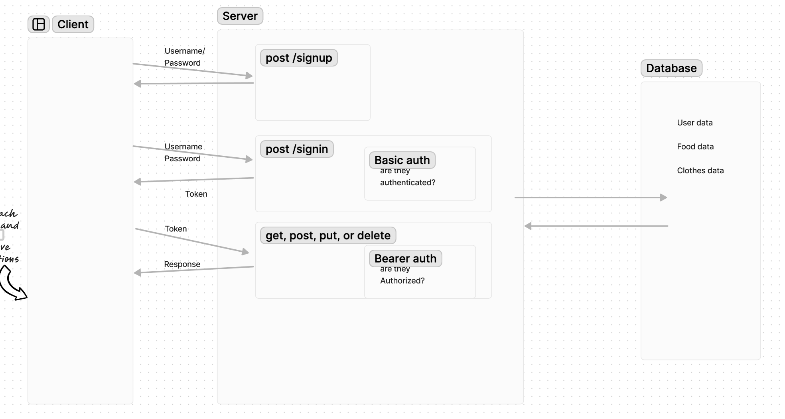

# auth-api

**Author**: Brendan McMullen
**Version**: 1.0.0

## Overview
The server makes a database of food types and clothes types. Users must login and will have the following restrictions:\
Regular users can READ\
Writers can READ and CREATE\
Editors can READ, CREATE, and UPDATE\
Administrators can READ, CREATE, UPDATE, and DELETE\

## Getting Started
To activate the server install dependencies and type node index.js or nodemon into your shell.

## Architecture
Node.js
express
dotenv
PostgreSQL14
Basic-64
bcrypt

## Change Log

05-7-2024 8:50pm - Full Functionality

## Credit and Collaborations
chatgpt was used as a resource

## UML Diagram
